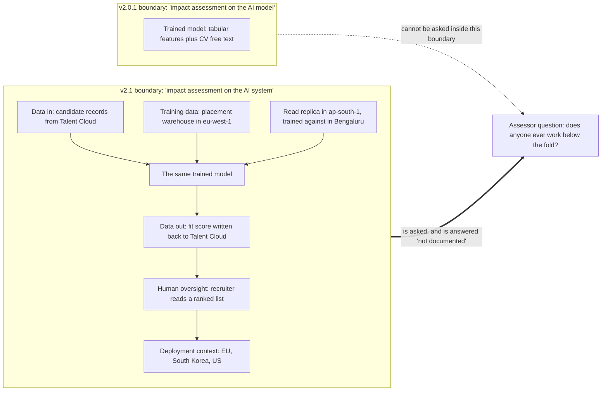

# 01 · One indicator, read in both editions

**Concept 1 of 9 · Use case 1 — Take stock: what these four systems actually are**
*Trainer material. Not part of artefact A, and it carries no artefact version or owner.*
*Written 2026-09-09. Source keys resolve in `README.md` of this folder.*

---

## The idea

Everything this use case does rests on one claim: the thing a governance professional is
asked to govern is not the trained model, it is the **system built around it**. That
claim is not an opinion of this course. It is a change somebody made to the certification
blueprint, and it can be read in a single line of text that exists in two versions. Read
that one line in both editions and the whole distinction stops being an abstraction: it
is a word that was replaced, in a sentence that tells a person what to do.

## The material — the same performance indicator, two editions

Sub-domain **III.A**, "Govern the designing and building of the AI model / system":

> **v2.0.1** (effective 3 February 2025):
> "Perform or review an impact assessment on the AI **model**."
> — `005_research/2026-09-07/extracts/aigp-bok-v2.0.1.txt`, line 273

> **v2.1** (approved 9 September 2025, effective 2 February 2026):
> "Perform or review an impact assessment on the AI **system**."
> — `005_research/2026-09-07/extracts/aigp-bok-v2.1.txt`, line 296

Both files are `pdftotext` extracts of the IAPP's own published PDFs, captured and read
2026-09-07 [BOK-2.1, DIFF].

## Worked, to its answer

Take one real assessor with one real system: somebody at Kabini has been told to perform
an impact assessment on **MatchScore**, the CV-ranking system its Bengaluru team built
[PRJ §1]. What is inside the boundary of the task?

| | Under the v2.0.1 wording | Under the v2.1 wording |
|---|---|---|
| The trained model and its features | in | in |
| The training data — eight years of placement outcomes | out | **in** |
| Where the training data sits, including the `ap-south-1` replica | out | **in** |
| Where the score goes — written back into Talent Cloud | out | **in** |
| Whether a recruiter ever works below the fold of the ranked list | out | **in** |
| Which markets it is used in | out | **in** |

The two columns are a reading of what each wording obliges, not a quotation of the
blueprint. The row that carries the point is the recruiter row, where the two wordings
plainly differ.

**The answer.** The single word changed the boundary of the task, and it moved the
recruiter into it. Under the old wording, an assessor who documented the model was
finished. Under the current wording, an assessment that never mentions the recruiter is
incomplete — because the recruiter is the part of the system through which the score
reaches a person.

**And it is not one line.** The same substitution runs through both lifecycle domains:
the Domain III scope note reads "maintaining AI **models**" in v2.0.1 (line 268) and
"maintaining AI **systems**" in v2.1 (line 291); the IV.A competency title reads "the
decision to deploy the AI **model**" (v2.0.1 line 369) and "the AI **system**" (v2.1
line 401); the IV.C indicator reads "assess the AI **model's** performance" (v2.0.1 lines
388–389) and "the AI **system's**" (v2.1 lines 419–420); the deactivation indicator reads
"localize an AI **model**" (v2.0.1 line 397) and "an AI **system**" (v2.1 line 428).
Six rewrites are itemised in [DIFF §5]. Those two domains are printed at **21–25**
questions each on the blueprint's own Domain III and Domain IV pages.

## The turn

Put the two lines on the board with nothing else on it, and ask the room which word
changed. Then ask what the assessor is now obliged to look at that they were not obliged
to look at before. The answer arrives from the room, not from you: **the recruiter.**

## Where this shows up for real

`../demo/A_annex_1_classification_rules.md`, rule **R1** and its "practical test"; and
`../demo/A_ai_system_inventory_and_use_case_register.md` §1, point 2 — which is why the
register governs four systems rather than the three models underneath them.

## What learners get wrong here

They treat model-versus-system as a definitional nicety and then answer scenario
questions about weights. The research report's finding is blunt: "Learners who think in
weights answer the wrong question," across roughly 46 questions' worth of material
[RR §4 item 2].
