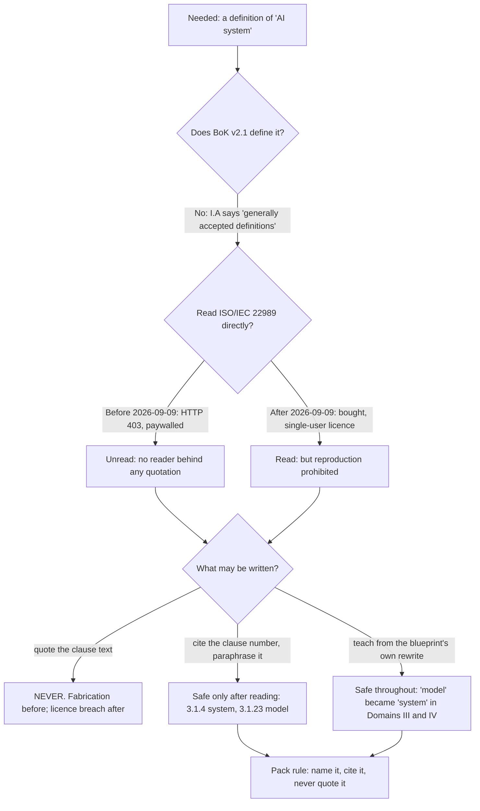

# 02 · The standard you may name and may not quote

**Concept 2 of 9 · Use case 1 — Take stock: what these four systems actually are**
*Trainer material. Not part of artefact A, and it carries no artefact version or owner.*
*Written 2026-09-09; revised the same day when the standard was bought. Source keys
resolve in `README.md` of this folder.*

---

## The idea

The room will ask where the word "system" comes from, and the honest answer has two
stages, because this pack has been in both. The certification names **ISO/IEC 22989**,
AI concepts and terminology, as one of the core ISO standards a candidate should
understand, and the standard is where the model-versus-system vocabulary comes from. For
most of this pack's life it was **unread** — paywalled, and `iso.org` returned HTTP 403.
It has since been bought and read, under a **single-user licence that prohibits
reproduction**.

Two different constraints, and they produce almost the same rule:

- **Unread** — you may not quote it, because nobody behind the quotation has seen it.
- **Read but licensed** — you may not quote it, because you do not have the right to
  reproduce it.

So the question the room should work is not "what does 22989 say". It is **what may be
written down, and why the reason matters even when the answer looks identical**. That is
a governance question, and it is the same one the register asks of Attestra later on.

## The material — what was actually reachable, and when

| Step | What was tried | Result |
|---|---|---|
| 1 | The blueprint's own text, sub-domain II.D | Read in full. It says, verbatim: "Understand the core ISO AI standards (i.e., 22989, 42001 and 42005)." — `extracts/aigp-bok-v2.1.txt` lines 271–272. The v2.0.1 line read "(i.e., 22989 and 42001)" — `extracts/aigp-bok-v2.0.1.txt` line 253 |
| 2 | Does the blueprint define "AI system" anywhere? | **No.** The nearest thing is I.A's first indicator, "Know the **generally accepted** definitions and types of AI" — `extracts/aigp-bok-v2.1.txt` line 130. "Generally accepted" is the blueprint declining to publish a definition |
| 3 | The standard itself, at `iso.org`, when the pack was written | **HTTP 403.** Recorded in the research report: "I could not load `iso.org` directly — HTTP 403" [RR §2.5]. Paywalled, and not read |
| 4 | Was the attribution itself sourced, at that point? | Yes, and only to this: "**ISO/IEC 22989** — AI concepts and terminology. In the BoK. This is where the *model* vs *system* distinction the v2.1 BoK adopted comes from." [RR §2.5] |
| 5 | **The standard, bought — 2026-09-09** | A single-user licensed copy from the ISO Store, read [ISO-22989]. It **confirms step 4**: clause **3.1.4** defines an AI system as an engineered system that generates outputs; clause **3.1.23** defines a model as a representation. Every page is watermarked and the licence prohibits copying |

## Worked, to its answer

Five sentences a trainer might put on a slide. Which survive?

| Candidate sentence | Verdict |
|---|---|
| "ISO/IEC 22989 is the ISO standard for AI concepts and terminology, and the blueprint names it." | **Safe.** Resolves to the blueprint line at step 1 |
| "The model-versus-system distinction the blueprint adopted comes from ISO/IEC 22989." | **Safe, and now better than an attribution.** It was [RR §2.5]'s statement cited as such; since step 5 it is a reading of the standard, checked at clauses 3.1.4 and 3.1.23 |
| "ISO/IEC 22989 clause 3.1.4 is where 'AI system' is defined, and it turns on the system being *engineered* and *generating outputs* — where a model, at 3.1.23, is a representation." | **Safe, and this is the new sentence.** A clause number and a paraphrase, neither of which reproduces the text |
| "ISO/IEC 22989 defines an AI system as *'…'*" — with the clause in quotation marks | **Not safe. Do not write it.** Before step 5 the defect was that nobody had read it. After step 5 the defect is that the licence forbids reproducing it. The sentence is prohibited either way, and it is worth saying out loud that the *reason* changed |
| "The governed object in Domains III and IV is the AI system." | **Safe, and it needs no standard at all.** Read off the blueprint's own rewrite — concept 01 |

**The answer.** You may name the standard, you may now cite a clause number, and you may
teach the distinction in your own words. You may still not put ISO wording on a slide.
Nothing in the pack does: `A_annex_1_classification_rules.md` carries the caveat on its
face in its revised form, and no 22989 wording appears anywhere in artefact A.

## The turn

Ask the room for a definition of "AI system". Somebody will offer one confidently. Ask
them where they read it. That pause is the lesson, and it is the same pause the register
records against the Attestra check in concept 09: **a claim whose source you cannot name
is a claim you mark, not a claim you delete and not a claim you assert.**

Then, if the room is a good one, add the second turn. Tell them the standard has since
been bought and read, and ask whether the slide may now carry the clause text. The answer
is still no, for a completely different reason. **Two different defects can produce the
same prohibition, and a governance document should say which one it is under** — which is
exactly why Annex 1's caveat was rewritten rather than deleted.

## Where this shows up for real

`../demo/A_annex_1_classification_rules.md`, "One honest caveat, on the face of the
annex"; `../demo/A_sources.md` §3 for the **[ISO-22989]** key and §4 for the ISO/IEC
22989 row of the claim table; and the register's change-control entry **1.0.3**, which
records the caveat's revision and why it tightens rather than relaxes the rule.

## What learners get wrong here

They expect a certification to hand them one canonical definition and get unsettled when
it does not. The blueprint's own wording — "generally accepted definitions" — is the
answer to give them, and it is worth reading out loud once.

The second thing they get wrong, once they hear the standard has been bought, is
assuming that ownership settles it. It does not. Buying a document buys the right to
read it, not the right to republish it, and a training pack is publication. Participants
who go home and paste a clause into their own AI policy have made the mistake this
concept exists to prevent.
