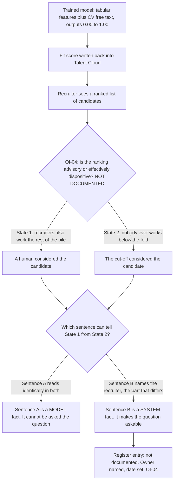

# 03 · One sentence, and the swap test

**Concept 3 of 9 · Use case 1 — Take stock: what these four systems actually are**
*Trainer material. Not part of artefact A, and it carries no artefact version or owner.*
*Written 2026-09-09. Source keys resolve in `README.md` of this folder.*

---

## The idea

Concept 01 showed that the governed object is the system. This one gives the room a test
they can apply to a single sentence in under ten seconds, so the distinction survives
first contact with an actual document. The test: Kabini's CV-ranking system is, today, in
one of two states, and nobody has written down which. Hold each candidate sentence up
against both states and ask whether the sentence can tell them apart. A sentence that
reads identically in both is a fact about the model. A sentence that names the part where
they differ is a fact about the system — and the part where they differ is the part
through which the model reaches a person.

## The material — one line about one system, and one thing nobody recorded

Kabini's own draft description of **MatchScore**, its in-house CV-ranking system, opens
with these words [PRJ §1, and `../demo/A_annex_2_worked_repair_matchscore.md`]:

> **Sentence A.** "Outputs a fit score from 0 to 1."

The repaired entry in the register's Annex 2 says it this way instead:

> **Sentence B.** "A fit score written back into Talent Cloud, shown to recruiters as a
> ranked list."

Nothing in A is false. It is a competent description and it would pass a technical review.

And the real, live uncertainty about the same system, recorded in the register as open
item **OI-04**:

> "Whether the ranking is advisory or effectively dispositive — whether anyone ever works
> below the fold — is not documented."

## Worked, to its answer

Two states. Both are Kabini's actual system as it runs today; the register's position is
that nobody knows which one is true, and finding out is assigned to Kavitha Rajagopal
with a date on it.

| | **State 1 — advisory.** Recruiters read the ranked list and then work the rest of the pile as well | **State 2 — effectively dispositive.** Nobody ever works below the fold |
|---|---|---|
| **Sentence A** — "outputs a fit score from 0 to 1" | Word for word the same | Word for word the same |
| **Sentence B** — "written back into Talent Cloud, shown to recruiters as a ranked list" | True, and it names the recruiter as the person whose behaviour has to be checked | True, and the ranked list has become the decision about who is ever seen |
| What the candidate experiences | A human considered them | A cut-off considered them |
| Can this sentence be asked which state we are in? | **A: no. B: yes** | **A: no. B: yes** |

**The answer.** Sentence A is identical in both states, so it cannot distinguish the
company that has a hiring aid from the company that has an automated shortlist — and no
amount of accuracy reported beside it changes that. It is a fact about the model.
Sentence B mentions the recruiter, which is precisely the part the two states differ in,
so it is a fact about the system, and it is the sentence that makes the question askable
at all. Kabini's answer to that question is **"not documented"**, which is why OI-04
exists, with a named owner and a due date rather than a blank.

That is the whole cost of a register built out of sentences like A. It is not that they
are wrong. It is that they are **invariant to the only difference that matters**, so the
question never gets put and the gap is never found.

## The turn

Put sentence A on the board on its own. Say: "this is true, and it stays true whichever
of those two companies Kabini turns out to be." Then read both states out. The sentence
does not move. **Ask the room how many sentences in their own inventory are like that —
true, precise, supplied by an engineer, and incapable of noticing the difference between
an aid and a decision.**

## Where this shows up for real

`../demo/A_annex_1_classification_rules.md`, rule **R1** and its practical test; the
seven-field repair in `../demo/A_annex_2_worked_repair_matchscore.md`, of which sentence
B is addition 3 and the human-oversight question is addition 4; and the AIS-001 record in
`../demo/A_ai_system_inventory_and_use_case_register.md` §3, fields "Data out" and "Human
oversight", where the unanswered question is recorded as open item **OI-04**.

## What learners get wrong here

They accept the distinction in the abstract and then write model sentences anyway,
because model sentences are the ones an engineer supplies and they sound precise. The
test is the cheapest defence: for every line of a register row, name something that could
differ about the system tomorrow and ask whether the line would notice.
