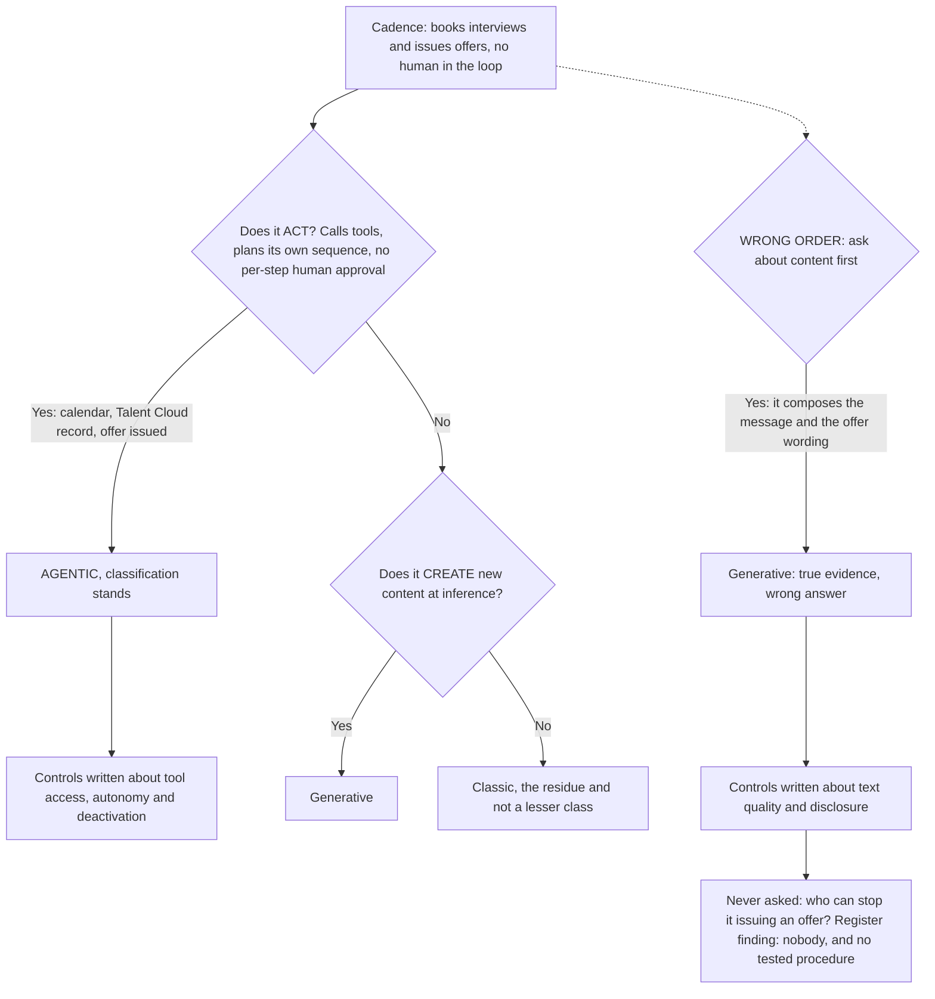

# 04 · Two questions, asked in the right order

**Concept 4 of 9 · Use case 1 — Take stock: what these four systems actually are**
*Trainer material. Not part of artefact A, and it carries no artefact version or owner.*
*Written 2026-09-09. Source keys resolve in `README.md` of this folder.*

---

## The idea

Classic, generative and agentic is not a three-way judgement call. It is two yes/no
questions and a residue, and the order of the two questions decides the answer. Ask
"does it act?" first and "does it create new content?" second, and classic is whatever is
left. Ask them the other way round and you classify an autonomous system by the most
visible thing about it rather than the most consequential, and every control written
afterwards is aimed at the wrong risk. Work one system through both orders and the room
sees the cost rather than being told the rule.

## The material — one system, in the client's own description

**Cadence** [PRJ §1]:

> "An agentic scheduling assistant in pilot that books interviews and issues offers
> without a human in the loop."

Everything below uses only that sentence and the facts in the register's AIS-004 record:
it plans a sequence of steps, calls tools — a calendar, a record in Talent Cloud, the
offer path — and completes them without a human approving each one.

## Worked, to its answer

**The right order.**

| Step | Question | Cadence | Effect |
|---|---|---|---|
| 1 | Does it **act** — take steps that change something outside itself, calling tools in a sequence it chooses, without a human approving each step? | **Yes.** It books an interview. It issues an offer. Nobody signs off in between | **Agentic. Stop here** |
| 2 | Does it **create new content** at inference? | Not reached | — |
| 3 | Residue: classic | Not reached | — |

**Classification: agentic.**

**The wrong order, run out to the end so the room can see where it lands.**

| Step | Question | Cadence | Effect |
|---|---|---|---|
| 1 | Does it **create new content**? | **Yes** — it composes the scheduling message and the offer wording | Generative. Stop here |
| 2 | Does it act? | Never asked | — |

**Classification: generative — and it is wrong.** Notice that the evidence in the wrong
run is not false. Cadence does compose text. The failure is that the answer is true and
irrelevant, and it closes the enquiry before the load-bearing question is put.

**What the wrong answer costs, concretely.** Controls written for a generative system are
controls about the text: is the answer accurate, is it disclosed as AI, is the tone
right. Not one of them asks who can stop Cadence issuing an offer at two in the morning.
Kabini's register records that there is **no documented way to stop it, no named person
who can, and no tested procedure** — a finding that exists only because the first
question asked was whether it acts.

## The turn

Do not give the order first. Ask the room to classify Cadence cold; somebody will say
generative and will be able to defend it. Let them. Then ask one follow-up — what control
does that classification make you write? — and when the answer comes back about the
wording of the message, read out the deactivation line from the register.

## Where this shows up for real

`../demo/A_annex_1_classification_rules.md`, rules **R2**, **R3** and **R4**; and the
AIS-004 record in `../demo/A_ai_system_inventory_and_use_case_register.md` §3, fields
"Type", "Why that type" and "Deactivation".

## What learners get wrong here

They treat agentic as a stronger flavour of generative rather than as a property of a
different thing — the system, not the model. Three things make a system agentic and all
three sit outside the model: tool access, multi-step planning it does itself, and the
absence of a per-step human approval.
