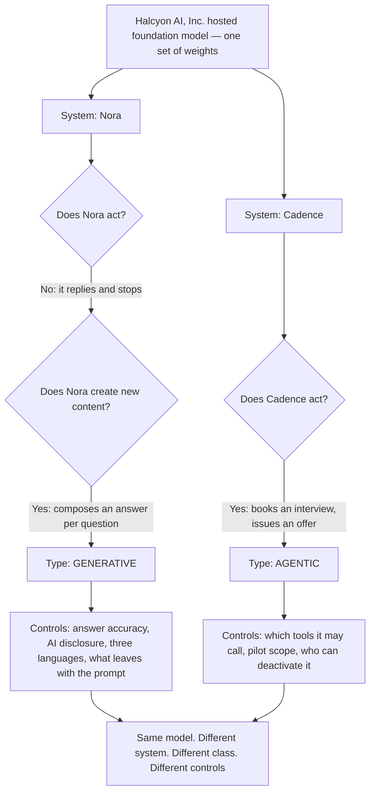

# 05 · One model, two systems, two answers

**Concept 5 of 9 · Use case 1 — Take stock: what these four systems actually are**
*Trainer material. Not part of artefact A, and it carries no artefact version or owner.*
*Written 2026-09-09. Source keys resolve in `README.md` of this folder.*

---

## The idea

The classification belongs to the system, not to the weights. That sentence is easy to
nod at and hard to believe, so this concept makes it unavoidable by taking one model —
literally one, the same hosted endpoint — and running the classification twice, once for
each system built on it. The two runs give different answers, which is only possible if
the class was never a property of the model in the first place. This is concept 03
arriving as a concrete argument, and it is the argument the room has.

## The material — two systems, one endpoint

Both from [PRJ §1]:

> **Nora** — "a candidate-facing chatbot on a procured foundation model, answering
> placement and payroll questions in English, Dutch and Hindi."

> **Cadence** — "an agentic scheduling assistant in pilot that books interviews and
> issues offers without a human in the loop."

And the fact that makes the pair worth teaching: **the foundation model behind Nora** is
licensed from Halcyon AI, Inc., and Halcyon's hosted API is also what sits under Cadence
[PRJ §1]. Same vendor, same hosted model, two systems.

## Worked, to its answer

The same two questions from concept 04, put to each system in the same order.

| | **Nora** | **Cadence** |
|---|---|---|
| The model | Halcyon AI hosted foundation model | The same Halcyon AI hosted foundation model |
| Q1 — does it act, calling tools in a sequence it chooses, with no per-step human approval? | **No.** It answers the question and stops | **Yes.** Calendar, Talent Cloud record, offer issued |
| Q2 — does it create new content at inference? | **Yes.** It composes an answer for the question in front of it | Not reached |
| **Type** | **Generative** | **Agentic** |
| What a human can change before it reaches a person | Nothing: no human reviews an answer before the candidate reads it | Nothing: no human is in the loop, by design |
| What the system can do to a person | Tell a worker something about their own pay | Book them, or issue them an offer |

**The answer.** Identical weights. Two classes. Two control sets. Nothing about the model
distinguishes them, and everything about the systems does: what each is connected to,
what each is allowed to do, and whether anything of consequence happens when it is wrong.

**And the counting question the room should be made to ask.** How many things does Kabini
have to govern here? Counting models gives one. Counting systems gives two. Only the
count of two can be governed, because a control that fits Nora — say, a disclosure that
the answer came from an AI — does nothing whatever about an offer that went out at two in
the morning. Across the whole register the arithmetic is four systems, three models, two
vendors.

## The turn

Say the sentence flatly — "these two run on the same model" — and then ask whether they
are the same entry in the register. Let somebody argue that they are; it is the right
instinct badly aimed. The close is one line: **if the class came from the model, these
two would have the same one.**

## Where this shows up for real

`../demo/A_ai_system_inventory_and_use_case_register.md` §1, "The one thing to notice
before reading the rows", and §4 finding 1; the AIS-002 and AIS-004 records at §3; and
`../demo/A_annex_3_room_worksheet.md`, argument 1 of the four the trainer lets the room
have.

## What learners get wrong here

They inventory the vendor rather than the deployment: one row for "the Halcyon model,
used by two teams". The research report records the same instinct in a neighbouring
form — learners want to classify an organisation once, where the certification wants
them to classify an activity [RR §4 item 3]. Roles per activity are use case 3; the
register stops at recording the two systems separately.
