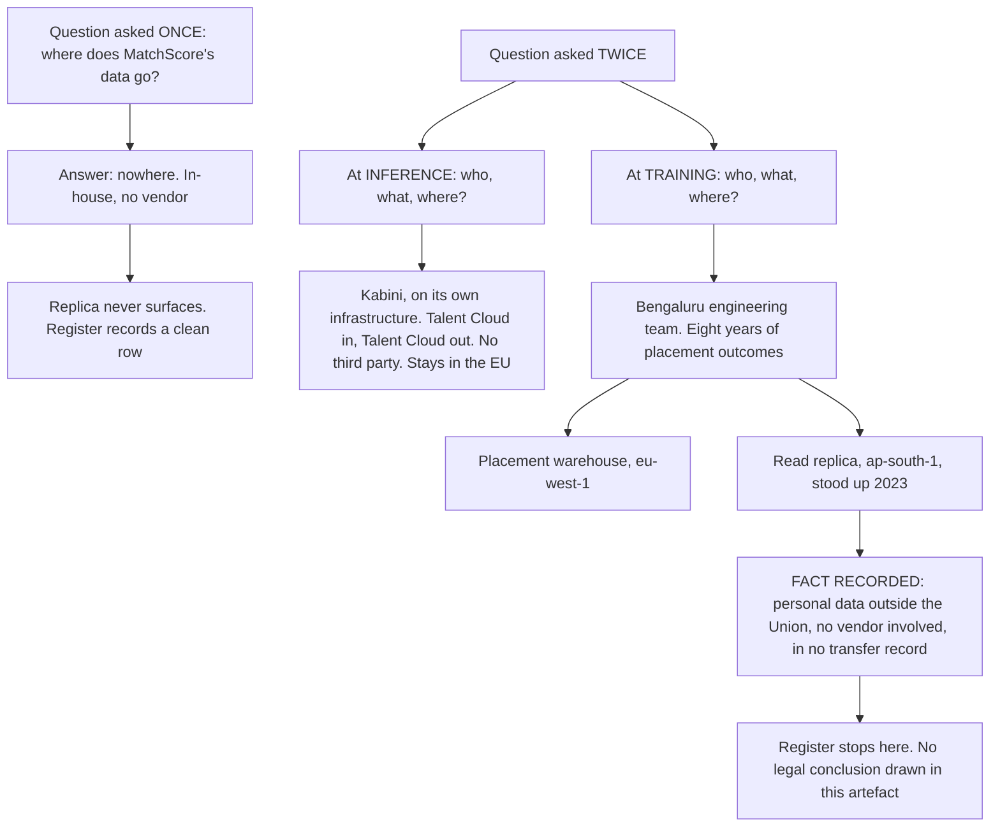

# 06 · Ask "where does the data go" twice

**Concept 6 of 9 · Use case 1 — Take stock: what these four systems actually are**
*Trainer material. Not part of artefact A, and it carries no artefact version or owner.*
*Written 2026-09-09. Source keys resolve in `README.md` of this folder.*

---

## The idea

Training and inference are two different events, with different data, different
geography and often different parties — and an inventory that has one row for "where
does the data go" will answer for whichever of the two the person filling it in happened
to be thinking about. Splitting the question into two is the smallest possible change to
a form, and on this client it is the change that surfaces the most consequential fact in
the whole register. Work it on one system and the room watches a fact appear that was
invisible one question earlier.

## The material — one system, and the facts as the client states them

**MatchScore** [PRJ §1]:

> "A CV-ranking model built in-house **by the Bengaluru engineering team** on tabular and
> free-text data, scoring candidate fit for a role."

> "**The placement warehouse** — eight years of historical placement outcomes on
> Amazon-hosted infrastructure in `eu-west-1`. This is MatchScore's training data, and
> nobody has ever written down where all of it came from."

> "**The Bengaluru replica** — a read replica of the placement warehouse in `ap-south-1`,
> stood up in 2023 so the engineering team could train against real data without a
> four-hour round trip. Nobody wrote that down either, and it is not in any transfer
> record. It is how MatchScore is actually built."

## Worked, to its answer

**Ask it once.** *Where does MatchScore's data go?*

> Nowhere. Kabini built it, Kabini runs it. A candidate record comes out of Talent Cloud,
> a score goes back into Talent Cloud. There is no vendor in the path.

That answer is accurate, it is what a competent engineer would say, and every word of it
is about inference.

**Ask it twice.**

| | **At inference time** | **At training time** |
|---|---|---|
| Who performs it | Kabini, on Kabini's own infrastructure | Kabini's **Bengaluru engineering team** |
| What data | One candidate record scored against one vacancy | Eight years of historical placement outcomes |
| Where it sits | Talent Cloud, in and out | The placement warehouse in `eu-west-1` — **and a read replica in `ap-south-1`** |
| Third party involved | **None** | **None** |
| Leaves the European Union | No | **Yes** |

**The answer.** Personal data leaves the Union, and no vendor is involved. The replica was
stood up in 2023 for a good engineering reason — a four-hour round trip is a real cost —
and it is in no transfer record, because nobody had to write one. Kabini's two *known*
external data flows exist on paper only because somebody signed a contract for them. This
one had no contract, so it had nothing to be written on, and a register with a single
"where does the data go" row would have recorded it as **nowhere**.

**Where this concept stops, deliberately.** That is a data-flow fact and nothing more.
Whether it is a restricted transfer, what mechanism it needs and what has to be assessed
is not settled here and is not settled in the register either; it is later work, and the
register's own restraint is the model to copy. Recording the fact is what makes that
later work possible.

## The turn

Ask the room the single question and let somebody answer "nowhere". Write it up. Then ask
the same question again with two words added — *at training time* — and let the same
person correct themselves. The moment the correction happens, say what it cost: **one row
on a form.**

## Where this shows up for real

`../demo/A_annex_1_classification_rules.md`, rule **R5**; the AIS-001 record in
`../demo/A_ai_system_inventory_and_use_case_register.md` §3, the two rows "What happens
at training time" and "What happens at inference time" and the row beneath them, "Where
the training data sits"; finding 7 at §4, which the register calls its most consequential;
and open item **OI-12**.

## What learners get wrong here

They answer for inference, because inference is the part they can see running. The
inventory question that catches it is not "is there a vendor" but "who performed the
training, and where were they sitting when they did it".
