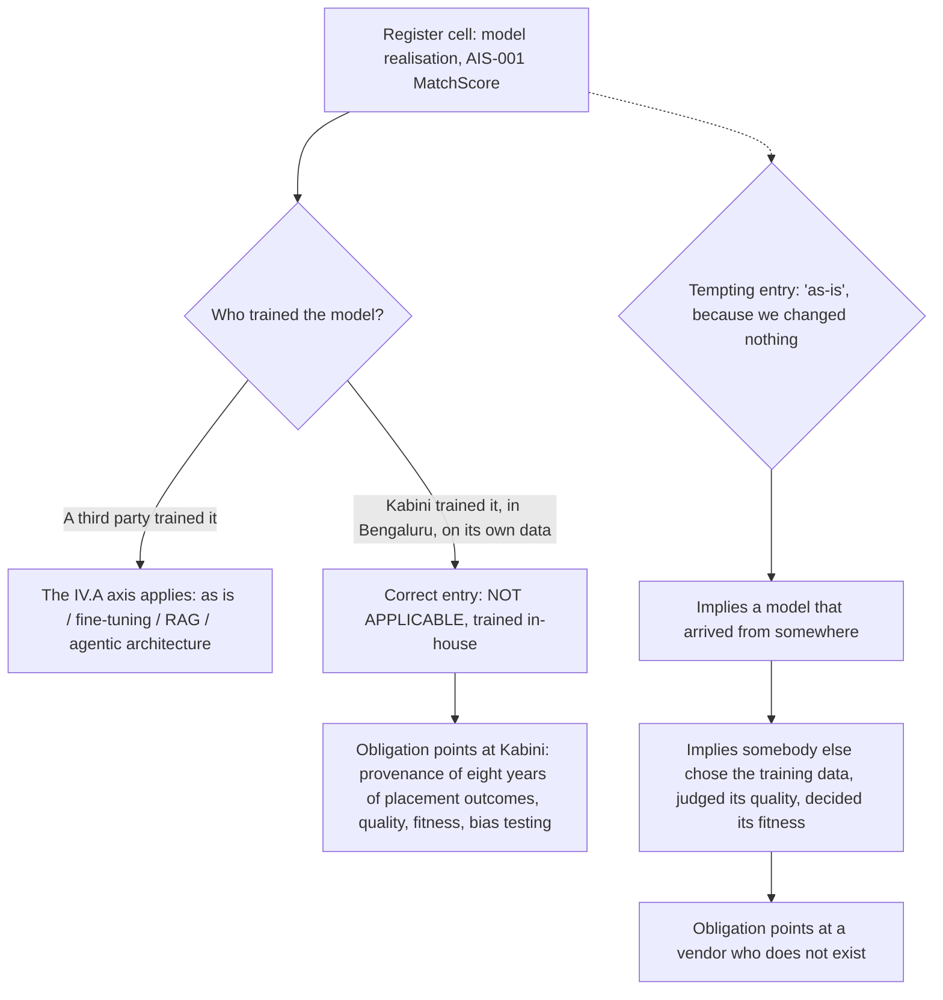

# 07 · The column that has nothing to say

**Concept 7 of 9 · Use case 1 — Take stock: what these four systems actually are**
*Trainer material. Not part of artefact A, and it carries no artefact version or owner.*
*Written 2026-09-09. Source keys resolve in `README.md` of this folder.*

---

## The idea

Every form has a column that looks answerable for everything, and the damage a form does
is usually done in that column. Here it is the one that asks how the model is realised —
as-is, fine-tuned, retrieval-augmented, agentic. Read the certification's own wording and
every item on that list is something an organisation does to a model **somebody else
trained**. So for a model the organisation trained itself, the column has nothing to say,
and the only correct entry is the one that says so. Working one cell of one row is enough
to show it, and to show what the plausible wrong entry costs.

## The material — the list, quoted exactly

Sub-domain **IV.A**, performance indicator, v2.1, verbatim:

> "Understand the differences in AI deployment options (e.g., cloud vs. on-premise vs.
> edge, and using the AI model **as is** or with **fine-tuning**, **retrieval augmented
> generation**, **agentic architectures**, or other techniques to improve performance and
> fit)."
> — `005_research/2026-09-07/extracts/aigp-bok-v2.1.txt`, lines 401–404. "Agentic
> architectures" is the phrase v2.1 added; v2.0.1's list ended at "retrieval augmented
> generation, or other techniques" [DIFF §5, "Other III/IV changes"]

And the system: **MatchScore**, "a CV-ranking model built in-house by the Bengaluru
engineering team on tabular and free-text data" [PRJ §1].

## Worked, to its answer

One cell. Two candidate entries. Both are defensible in a meeting; only one is right.

| Candidate entry | The case for it | Does it survive the indicator? |
|---|---|---|
| **"As-is"** | Kabini does not fine-tune MatchScore, does not retrieve into it and has not wrapped it in an agent. As-is looks like the honest residual | **No.** "Using the AI model as is" is one of four ways of deploying a model that already exists. Kabini's model did not already exist; Kabini made it |
| **"Not applicable — trained in-house from Kabini's own data"** | The axis describes what a deployer does to somebody else's pre-trained model, and there is no somebody else | **Yes** |

**The answer: "Not applicable — trained in-house from Kabini's own data."**

**What the wrong entry costs, and it is not a matter of taste.** "As-is" reads as an
answer, so nobody asks again. And it implies a model that arrived from somewhere, which
implies somebody else chose the training data, judged its quality and decided what the
system was fit for. **Kabini made all three of those decisions.** MatchScore's training
data is eight years of placement outcomes that nobody has ever written down the origin of
[PRJ §1] — the single heaviest data-governance obligation in the whole register — and
"as-is" quietly points a reader away from it. Four extra words point at it instead. It is
also why MatchScore, and not one of the bought systems, is the system this course carries
end to end.

**The residue rule, stated once.** A field is not finished because it contains a word. It
is finished when the word it contains is true of the thing in front of you, and
"not applicable, because ..." is a legitimate entry in any register that expects to be
audited.

## The turn

Ask the room to fill the cell. Most will write "as-is" and be pleased with it, because
it is the residual and residuals feel safe. Then read the indicator out loud, slowly,
stopping after "using the AI model" — and ask whose model that phrase is talking about.

## Where this shows up for real

`../demo/A_annex_1_classification_rules.md`, rule **R6**; the AIS-001 record in
`../demo/A_ai_system_inventory_and_use_case_register.md` §3, the "Model realisation"
field; the second trap in `../demo/A_annex_2_worked_repair_matchscore.md`; and argument 2
in `../demo/A_annex_3_room_worksheet.md`.

## What learners get wrong here

They read the four options as exhaustive because they are printed as a list, and lists in
a certification blueprint feel like taxonomies. This one is a list of deployment options
introduced by "e.g.", describing a situation — deploying a model you did not train — that
does not always obtain.
