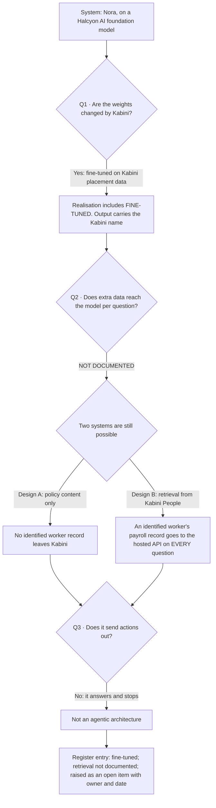

# 08 · Three questions that tell the realisations apart

**Concept 8 of 9 · Use case 1 — Take stock: what these four systems actually are**
*Trainer material. Not part of artefact A, and it carries no artefact version or owner.*
*Written 2026-09-09. Source keys resolve in `README.md` of this folder.*

---

## The idea

Concept 07 settled when the realisation column applies at all. This one settles what to
write in it, and the point is that the four options are not a menu you pick once from.
They are answers to three separate questions — are the weights changed, does extra data
reach the model at question time, does the system send actions out — and a system can
answer yes to more than one. Stopping after the first yes is the ordinary way this cell
gets filled and the ordinary way an inventory ends up describing a system that does not
exist. One system, three questions, and one of the answers is honestly unknown.

## The material — one system

**Nora** [PRJ §1]:

> "A candidate-facing chatbot on a procured foundation model, answering placement and
> payroll questions in English, Dutch and Hindi" — with "the provider/deployer question
> the moment Kabini fine-tunes it on its own placement data and puts its own name on the
> output."

Nora answers questions about **Kabini People**, the HR and payroll platform carrying
eleven thousand staff and forty thousand contractors [PRJ §1].

## Worked, to its answer

| # | Question | Nora | What the answer means |
|---|---|---|---|
| 1 | Does Kabini change the model's weights? | **Yes.** Kabini fine-tunes Halcyon AI's foundation model on its own placement data [PRJ §1] | **Fine-tuned.** Record beside it the fact that the answer goes out under Kabini's own name — a fact, recorded now, not a conclusion |
| 2 | Does extra data reach the model at question time, fetched per question? | **Not documented.** Nobody at Kabini has written down whether Nora looks up a worker's actual record to answer, or answers only from general policy content it was tuned on | Undecided between **fine-tuned only** and **fine-tuned plus retrieval-augmented** |
| 3 | Does the system send actions out — does it call tools that change something? | **No.** It answers and stops | Not an agentic architecture |

**The answer.** *Fine-tuned; whether it is also retrieval-augmented is not documented,
and that is an open item with a named owner and a date.*

**Why the unknown is the interesting half.** The two candidate designs are not variations
on one system. If Nora retrieves, then a named worker's payroll record is packed into a
prompt and sent to a third-party hosted endpoint **on every question**. If it does not,
no identified worker record ever leaves for that purpose. Same vendor, same model, same
fine-tuning, same screen for the person asking — and a completely different answer to
"what did you send, to whom, and how often". Nobody at Kabini knows which one they run,
and that is the sentence a register exists to produce.

**Note what did *not* finish the cell.** Question 1 came back yes, and a hurried writer
stops there: fine-tuned, done. The cell is not done. Fine-tuned and retrieval-augmented
are answers to different questions, and they compose.

## The turn

Get the room to fill the cell. They will write "fine-tuned" and look finished. Ask one
question: *when a contractor asks Nora what they were paid last month, where does the
number come from?* Nobody knows. Then say what each of the two possible answers would
mean, and let the silence do the work.

## Where this shows up for real

`../demo/A_annex_1_classification_rules.md`, rules **R7** and **R8** — the four-way table
and the paragraph beneath it on why the retrieval row matters even though nothing in the
register is confirmed as retrieval; the AIS-002 record in
`../demo/A_ai_system_inventory_and_use_case_register.md` §3, the fields "Model
realisation" and "A gap that matters more than it looks"; open item **OI-05**; and
argument 4 in `../demo/A_annex_3_room_worksheet.md`.

## What learners get wrong here

Two things. They treat the four realisations as mutually exclusive, when a system can be
fine-tuned and retrieval-augmented and agentic at once. And they treat fine-tuning as a
purely technical fact, when what it changes is whose name is on the answer — which is why
the register records that alongside it. Who is provider and who is deployer for which
activity is a later exercise, and this register deliberately does not attempt it.
