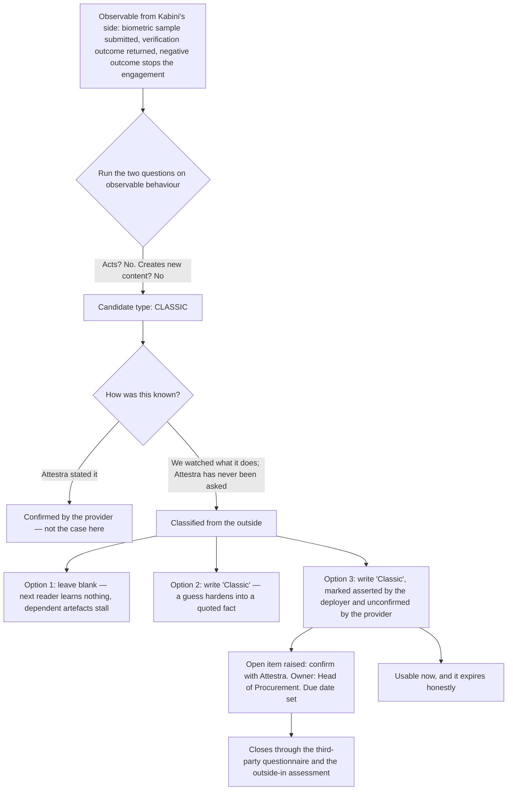

# 09 · A classification you made from the outside

**Concept 9 of 9 · Use case 1 — Take stock: what these four systems actually are**
*Trainer material. Not part of artefact A, and it carries no artefact version or owner.*
*Written 2026-09-09. Source keys resolve in `README.md` of this folder.*

---

## The idea

Some rows in an inventory are about systems the organisation cannot see inside. The
instinct is to leave those cells blank, because filling them feels like making something
up. The opposite instinct — fill them in confidently — is worse, because a guess written
plainly becomes a fact that three later documents quote. There is a third entry, and it
is the one a register wants: classify on the behaviour you can actually observe, and mark
on the face of the row that this is what you did. The mark is the governance, not the
classification. This is concept 02's discipline applied to a system rather than to a
standard.

## The material — one system nobody at Kabini has seen inside

**The right-to-work check** [PRJ §1]:

> "A biometric identity verification service bought from **Attestra Inc.** (Delaware,
> United States)" — carrying "special category data, cross-border transfer, third-party
> assessment of a system Kabini did not build and cannot inspect."

What Kabini can observe: it submits identity data including a biometric sample, and a
verification outcome comes back. A negative outcome stops the engagement. What Kabini has
been told about the mechanism: nothing. What Kabini has asked Attestra: nothing.

## Worked, to its answer

The evidence available, run through the same two questions as every other row:

| Question | On the observable behaviour | Confidence |
|---|---|---|
| Does it act, calling tools without a human per step? | No. It returns a determination to Kabini's onboarding process | High — this is Kabini's own side of the interface |
| Does it create new content? | No. It compares a submitted sample against a reference and returns an outcome | **Inferred from behaviour.** Attestra has never stated it |
| Residue | **Classic** | Only as strong as the row above |

Three candidate entries for the "Type" cell:

| Entry | What it tells the next reader | Verdict |
|---|---|---|
| *(blank)* — "we cannot know, so we will not say" | Nothing at all. And it stalls every artefact that hangs off this row: an assessment, a questionnaire, a memo | **Rejected.** A blank is not caution, it is an absence |
| **"Classic"** | That Kabini knows this. It does not | **Rejected.** Within two documents nobody remembers it was a guess |
| **"Classic — asserted by the deployer from observed behaviour, unconfirmed by the provider"**, with an open item to confirm it | Exactly how far to trust the cell, and who is finding out by when | **Correct** |

**The answer.** *Classic, marked as classified from the outside, with confirmation raised
as an open item against the Head of Procurement.* The classification is usable
immediately — it is enough to plan an assessment around — and it carries its own
expiry date, because the mark tells the next reader the row is provisional and the open
item names the person closing it.

**And this is the row where the register makes its bluntest statement about honesty.** It
records the internal mechanism as unknown, on the page, rather than describing one:
a register that invents a mechanism it has not been shown is worse than one that says it
does not know.

**One thing the mark does not do.** It does not lower the system's importance. This is
the system that decides whether a person may work at all, and it is one of two in the
register with no permanent business owner — a finding, not an omission.

## The turn

Hand the room the Attestra paragraph and ask for the Type cell. Somebody will refuse to
answer and somebody will answer flatly; both are half right. Put the third entry on the
board and ask which of the three a procurement officer at a client would rather receive.

## Where this shows up for real

`../demo/A_annex_1_classification_rules.md`, rule **R9**; the AIS-003 record in
`../demo/A_ai_system_inventory_and_use_case_register.md` §3, fields "Why that type — and
read this carefully" and "Internal mechanism"; open items **OI-02** and **OI-06**; and
argument 3 in `../demo/A_annex_3_room_worksheet.md`.

## What learners get wrong here

They think the choice is between knowing and not knowing. The choice a governance
document actually offers is between an unmarked claim and a marked one, and the marked
one is the only version that stays true as the file is copied into the next document.
